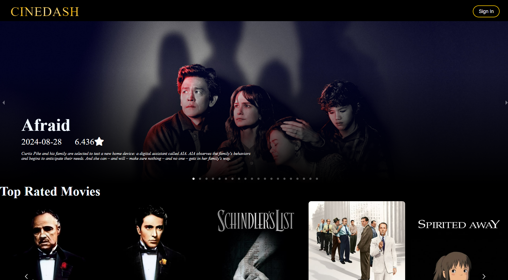
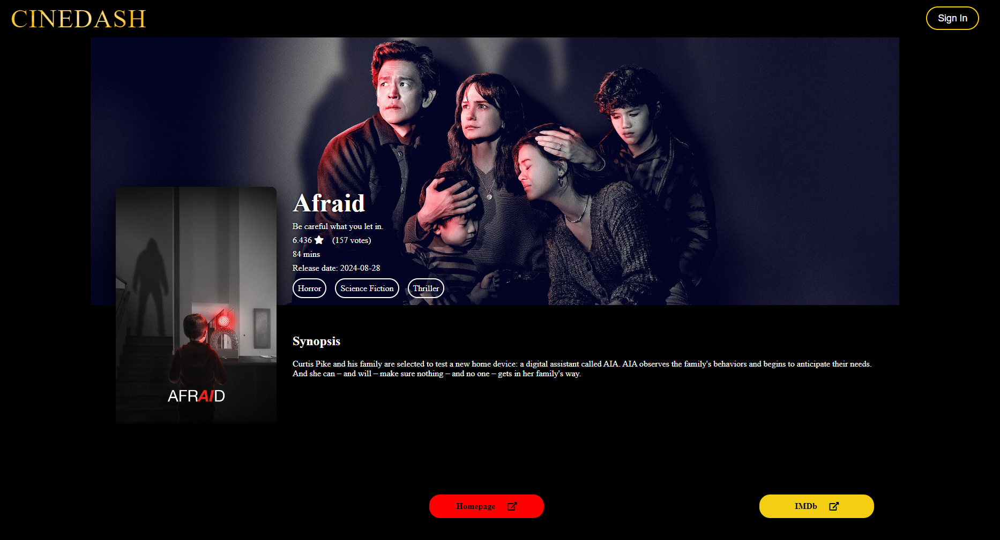

# CineDash

Project created by Samuele, Supriya, Anabil.

## TMDB API
This app uses an external API: "The Movie DataBase" (TMDB).

To make sure (REST) requests work properly, a .env file, containing an API key, needs to be added to the backend of the app.

To do so,
1. Create a TMDB account and get your API key at https://developer.themoviedb.org/docs/getting-started,
2. Go to the *cinedash_backend/cinedash_project* folder,
3. Add a .env file,
4. And, inside .env, write your API key like this:
```
TMDB_API_KEY = your_api_key_goes_here
```
\* Example of request url: https://api.themoviedb.org/3/movie/550?api_key={TMDB_API_KEY}

## How to run back-end

Go to backend directory and start Django server:
```bash
cd CineDash/cinedash_backend/cinedash_project
python manage.py runserver
```

## How to run front-end

First set this environment variable...

On Linux/macOS:
```bash
export NODE_OPTIONS=--openssl-legacy-provider
```
On Windows Command Prompt:
```cmd
set NODE_OPTIONS=--openssl-legacy-provider
```
On Windows PowerShell:
```powershell
$env:NODE_OPTIONS="--openssl-legacy-provider"
```

Then go to the frontend directory and start the React app:
```bash
cd CineDash/cinedash_frontend
npm start
```

## Screenshots of the app
### Home Page

### Movie Page

